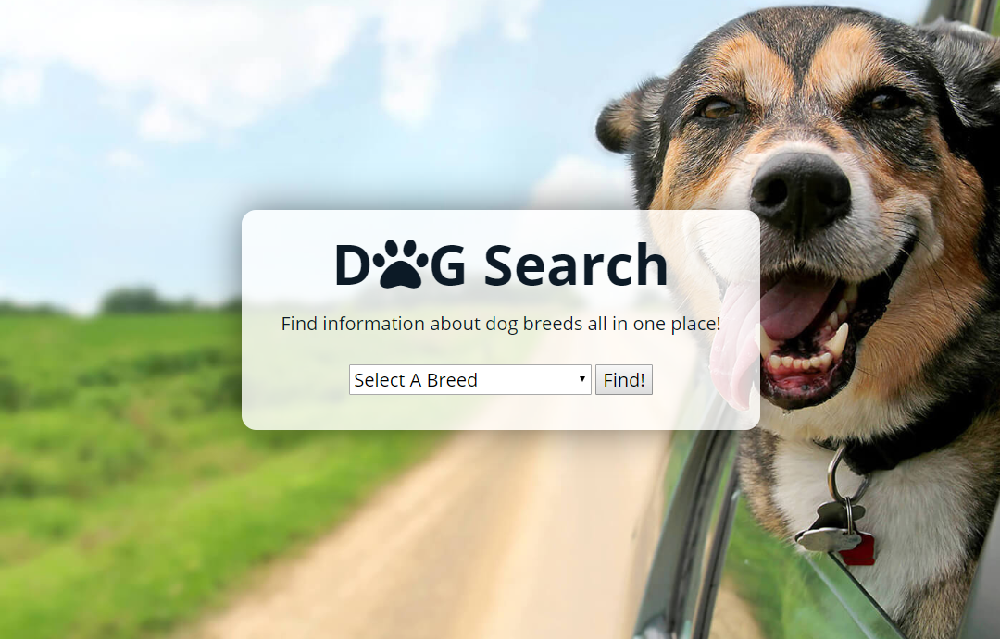
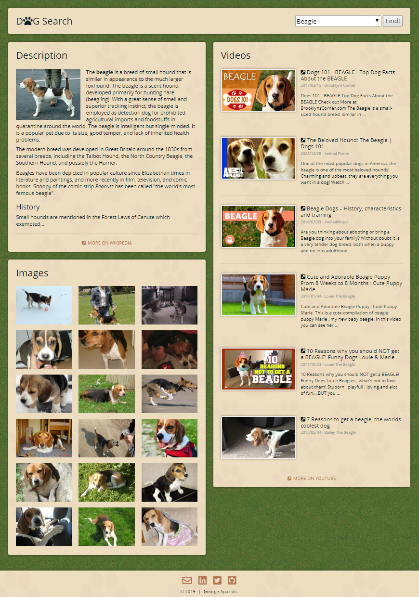

# Dog Search #

"Dog Search" is a web app that displays dog breed information. A one-click search on "Dog Search" displays the following information on the same page:

(1) The introduction section of the Wiki page for the dog breed, along with a relevant image when provided by the Wiki page;

(2) Images of the dog breed provided by the dog.ceo API;

(3) And YouTube video clips.

The advantage of this app over a regular search engine is that all information is actually drawn out of these different sources and displayed on the app page itself, saving the user from having to search a dog breed on an engine, scroll to and click on the images, Wikipedia or YouTube page, wait for the new page to load, and find relevant information on the new page. "Dog Search" organizes the data on a single page and makes descriptions, images, and YouTube clips accessible in one place.

## Demo ##

* [Live Demo](https://george-apazidis.github.io/dog-search-api-capstone/)

## User Stories & Wireframe ##
* As a new user, I want to understand what the app is and decide whether to use it.
* As a new user, I would like to search for different dog breeds to find descriptions, pictures and videos of that breed.

## User Flow ##

## Screenshots ##
Landing page:

Results page (results for "Beagle" search):

## Technology ##

* HTML5
* CSS3
* JavaScript
* jQuery

"Dog Search" uses AJAX calls to request and load data asynchronously from public APIs in response to user click events detected by event-handlers. Using jQuery DOM taversal and manipulation, the data is displayed in an organized layout that has been made responsive and mobile-first by CSS media-queries, allowing the page to be usable and equally optimized on devices with small and large screens alike.

## Development Road Map ##

Features for future iterations include:
* Add an image gallery plugin inside a modal window when a user clicks on an image
* Add a modal window to play YouTube videos when the user clicks on the Youtube title or thumbnail
